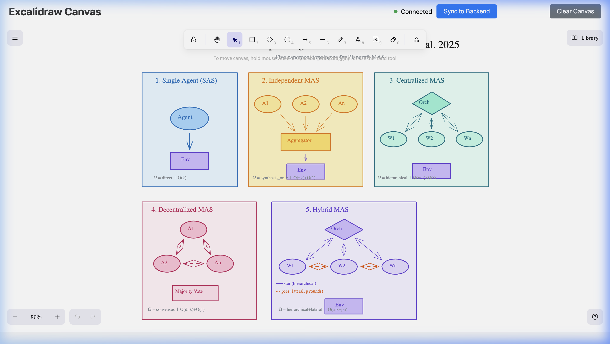

# Agent Architectures

This document describes the five canonical multi-agent system (MAS) architectures implemented in this codebase, based on **"Towards a Science of Scaling Agent Systems"** (Kim et al., 2025, arXiv:2512.08296, §3.1 / Table 2).

All agents use the **GitHub Copilot SDK** as the LLM backend and share a common base class (`CopilotBaseAgent`) that provides conversation history management and an oracle recipe search tool.

---

## 1. Single Agent (SAS)

**File:** `copilot_single.py` → `CopilotSingleAgent`

| Property | Value |
|----------|-------|
| Agents | 1 |
| Communication | None |
| Orchestration (Ω) | Direct |
| Complexity | O(k) per step |

### How it works

The simplest architecture. A single LLM agent maintains a conversation history and interacts directly with the environment in a loop:

1. Receive observation from the environment.
2. Append observation to conversation history.
3. Call the Copilot LLM with the full history + system prompt.
4. Return the model's action to the environment.

If the agent outputs a `search:` action, the oracle recipe tool is invoked and the result is fed back into the conversation for a follow-up LLM call.

---

## 2. Independent MAS

**File:** `copilot_multi.py` → `CopilotIndependentAgent`

| Property | Value |
|----------|-------|
| Agents | n (default 3) |
| Communication | Agent → Aggregator only |
| Orchestration (Ω) | `synthesis_only` |
| Complexity | O(nk) + O(1) aggregation |

### How it works

An ensemble-style architecture with no inter-agent communication:

**Phase 1 — Parallel Exploration:**
- `n` agents independently call the LLM in parallel (using `asyncio.gather`).
- Each agent uses `temperature=0.7` for diverse proposals.
- There is no peer communication — agents cannot see each other's outputs.

**Phase 2 — Synthesis Aggregation:**
- All `n` proposals are concatenated into a single context string.
- One final LLM call (the aggregator, `temperature=0.0`) reads all proposals and synthesises a single concrete action.
- There is no voting, no comparison, and no error-correction — just synthesis.

### Key Design Decision
Performance improvements come purely from parallel exploration (ensemble-style reasoning), not from any cross-validation mechanism.

---

## 3. Centralized MAS

**File:** `copilot_multi.py` → `CopilotCentralizedAgent`

| Property | Value |
|----------|-------|
| Agents | 1 orchestrator + n workers (default 3) |
| Communication | Orchestrator ↔ All workers (star topology) |
| Orchestration (Ω) | `hierarchical` |
| Complexity | O(rnk) + O(r) orchestrator calls |

### How it works

A hierarchical star topology where a single orchestrator coordinates `r` rounds of work:

**Per round:**

1. **Orchestrator Directive** — The orchestrator LLM analyses the current state and issues a planning directive (what to do and why). It does NOT output a final action.

2. **Worker Proposals** — `n` workers receive the directive in parallel and each proposes an action (using `temperature=0.7`).

3. **Orchestrator Synthesis** — The orchestrator reviews all worker proposals and selects/synthesises the single best action.

After `r` rounds, the final synthesis is returned to the environment.

### Key Design Decision
Workers have no peer communication. All coordination flows through the orchestrator (star topology), ensuring a single point of control but also a single point of failure.

---

## 4. Decentralized MAS

**File:** `copilot_multi.py` → `CopilotDecentralizedAgent`

| Property | Value |
|----------|-------|
| Agents | n (default 3) |
| Communication | All-to-all peer (fully connected mesh) |
| Orchestration (Ω) | `consensus` |
| Complexity | O(dnk) + O(1) |

### How it works

An egalitarian architecture where agents debate and converge on a consensus:

**Initial Proposals:**
- All `n` agents propose actions independently in parallel.

**Debate Rounds (d rounds):**
- Each agent receives ALL peers' proposals as context.
- Each agent then updates its own position given the peer input.
- All agents within each round run in parallel.
- After `d` rounds of debate, proposals should converge.

**Consensus:**
- A simple **majority vote** (`collections.Counter`) over the final proposals selects the consensus action.

### Key Design Decision
There is no central authority. The consensus mechanism is a pure majority vote after `d` debate rounds. Memory cost scales as O(dnk) per agent since each agent must track an increasing conversation context across rounds.

---

## 5. Hybrid MAS

**File:** `copilot_multi.py` → `CopilotHybridAgent`

| Property | Value |
|----------|-------|
| Agents | 1 orchestrator + n workers (default 3) |
| Communication | Star (hierarchical) + Peer (lateral) |
| Orchestration (Ω) | `hierarchical + lateral` |
| Complexity | O(rnk + pn) per step |

### How it works

The most complex architecture, combining centralized orchestration with decentralized peer refinement:

**Per round (r rounds):**

1. **Orchestrator Directive** (hierarchical) — Same as Centralized: the orchestrator analyses the state and issues a directive.

2. **Worker Proposals** (star edges) — `n` workers propose actions in parallel based on the directive.

3. **Peer Refinement** (lateral, p rounds) — Workers exchange proposals among each other for `p` lateral rounds. Each worker sees all peers' proposals and outputs a refined action. This is the key differentiator from Centralized.

4. **Orchestrator Synthesis** — The orchestrator reviews the peer-refined proposals and selects the final action.

### Key Design Decision
The hybrid topology adds lateral peer communication on top of the hierarchical star. Workers can self-correct through peer exchange before the orchestrator makes its final decision. The trade-off is higher latency (additional `p` rounds per orchestrator round).

---

## Shared Infrastructure

### Base Class: `CopilotBaseAgent`
All agents inherit from `CopilotBaseAgent` (`copilot_base.py`), which provides:
- **Conversation history** management (`self.conversation`)
- **`reset()`** for episode boundaries
- **`_oracle_search()`** — recipe lookup tool using `gold_search_recipe()` from the Plancraft environment
- **`log()`** helper for debug output

### LLM Client: `copilot_llm.py`
- Wraps the GitHub Copilot SDK (`CopilotClient`) with retry logic (`call_copilot_with_retry`)
- Supports configurable `temperature` for controlling output diversity
- Handles rate limits and transient errors with exponential backoff

### System Prompt
All architectures share the same base system prompt that instructs the LLM on:
- Available actions: `move`, `smelt`, `impossible`, `search`
- Slot naming conventions (crafting grid, inventory)
- Crafting rules and multi-step strategy

---

## Hyperparameters

| Parameter | CLI Flag | Default | Description |
|-----------|----------|---------|-------------|
| n | `--num-agents` | 3 | Number of sub-agents |
| r | `--rounds` | 1 | Orchestrator/debate rounds |
| p | `--peer-rounds` | 1 | Lateral peer rounds (Hybrid only) |
| model | `--model` | gpt-5-mini | LLM model identifier |

These correspond to the paper's §3.1 / Table 2 hyperparameters.
